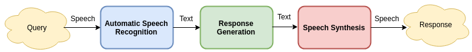

# Dialogue System

Yet Another Dialogue System Implementation

  

## Setup

Requirements:

* `python 3.5+`
* `pipenv`

Install requirements with `pipenv install` and activate virtualenv with `pipenv shell`.

If you don't want to spawn a new shell, activate virtualenv manually. To see where
virtualenv is created run `pipenv --venv`.

### Flask App

Set flask app env variable to `development` and run server
with `FLASK_ENV=development flask run`

You should see homepage [here](http://localhost:5000)
